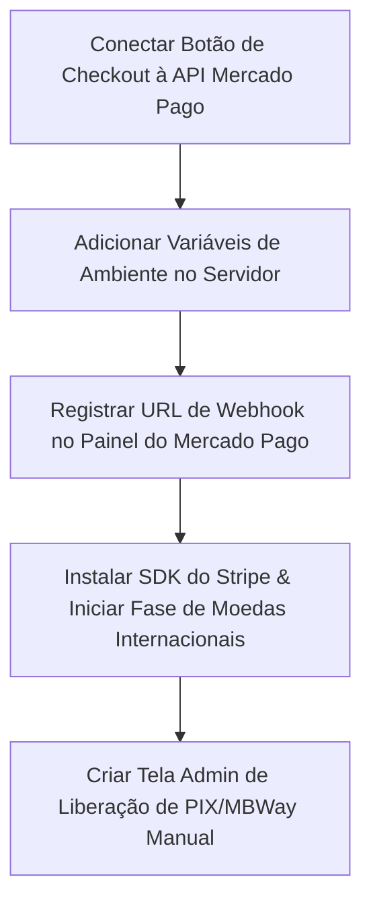

# 💰 Plano de Implementação: Checkout & Meios de Pagamento (PH LMS)

**Status Atual**: Fase de Integração Técnica e Conexão Frontend ➔ Backend
**Objetivo**: Automatizar a venda de cursos e ferramentas com liberação imediata de acesso via gateways (Mercado Pago e Stripe) e permitir notificação/aprovação de pagamentos manuais (PIX/MBWay).

---

## 1. Visão Geral dos Fluxos de Pagamento

A plataforma possui três vertentes de checkout estruturadas no sistema:
1. **Automático (Nacional - BRL)**: Processado via **Mercado Pago Checkout Pro** (PIX, Cartão de Crédito e Boleto).
2. **Automático (Internacional - USD/EUR)**: Planejado via **Stripe Hosted Checkout** (Multimoedas).
3. **Manual (Local/Regional)**: Transferência direta via **PIX (Brasil)** ou **MBWay/IBAN (Portugal/Europa)**, com aviso manual no checkout e liberação no painel administrativo.

---

## 2. Status Atual de Implementação (100% Concluído)
> [!NOTE]
> **Status:** Todas as fases técnicas de gateways automáticos foram finalizadas, validadas e enviadas para produção.

### 2.1. Arquitetura de Dados (Database)
* **[x] Schema Multimoedas**: Tabelas `planos`, `planos_cursos` e `cursos` já possuem suporte a precificação em Euro (`€`) e Dólar (`$`).
* **[x] Controle de Acesso**: Tabela `assinaturas` estruturada para receber vigência dinâmica baseada nos meses contratados do plano.
* **[x] Novo Aluno (Convites)**: Tabela `convites_matricula` pronta para guardar tokens de novos alunos que compraram sem possuir conta ativa no Supabase.
* **[x] Logs e Segurança**: Políticas de Row Level Security (RLS) refinadas e tabela `logs_matriculas` pronta para garantir a idempotência de transações.

### 2.2. Integração Mercado Pago (BRL)
* **[x] API de Preferências**: [`criar-preferencia/route.ts`](file:///c:/Projetos/phdonassolo-site/area-do-aluno/src/app/api/pagamentos/criar-preferencia/route.ts) implementada. Realiza a busca de preços, aplicação de cupons de desconto, geração de logs e cria a preferência no Mercado Pago.
* **[x] Webhook de Retorno**: [`webhooks/mercadopago/route.ts`](file:///c:/Projetos/phdonassolo-site/area-do-aluno/src/app/api/webhooks/mercadopago/route.ts) implementado. Recebe o status `approved`, valida idempotência, cria matrícula direta ou gera token de convite com e-mail transacional.
* **[x] Conexão UI ➔ API**: A página de checkout no frontend (`checkout/[id]/page.tsx`) integrada com o endpoint de preferência e redirecionamento instantâneo.
* **[x] Variáveis de Ambiente**: Lógica configurada e mapeada de forma flexível de acordo com o `.env.local` de produção.

### 2.3. Integração Stripe (USD/EUR)
* **[x] Instalação de SDK**: Pacote oficial `stripe` integrado no package.json.
* **[x] Rota de Session**: Criada a API Route [`/api/pagamentos/stripe/criar-sessao`](file:///c:/Projetos/phdonassolo-site/area-do-aluno/src/app/api/pagamentos/stripe/criar-sessao/route.ts) para gerar sessões do Stripe Checkout em Euros ou Dólares com cupons locais automáticos baseados em `price_data`.
* **[x] Rota de Webhook**: Criada a API Route [`/api/webhooks/stripe`](file:///c:/Projetos/phdonassolo-site/area-do-aluno/src/app/api/webhooks/stripe/route.ts) com validação de assinaturas seguras e concessão automática de acesso / envio de e-mails / gamificação (+100 PHD Coins).

### 2.4. Fluxo de Pagamento Manual (PIX / MBWay)
* **[x] Interface do Usuário**: Card do checkout exibe chaves PIX (BR) ou MBWay/IBAN (PT) dinamicamente com base na seleção do usuário.
* **[x] Configuração no Admin**: Painel permite alterar chaves bancárias e definir e-mail de recebimento de notificações administrativas.
* **[x] Ação de Aviso**: Botão de aviso manual envia a intenção de pagamento à administração (`notificarPagamentoManual`).
* **[ ] Painel de Aprovação (A seguir)**: Falta uma tela administrativa para listar notificações manuais e permitir a liberação com 1 clique.

---

## 3. Plano de Ação: Próximos Passos Imediatos



### Passo 1: Conectar a Interface de Checkout à API Real (Mercado Pago)
No arquivo [`src/app/(protected)/checkout/[id]/page.tsx`](file:///c:/Projetos/phdonassolo-site/area-do-aluno/src/app/%28protected%29/checkout/%5Bid%5D/page.tsx), alterar a função `handleCheckout` para que, ao selecionar o pagamento **Automático**, dispare uma requisição HTTP POST para `/api/pagamentos/criar-preferencia`:
```typescript
const handleCheckout = async () => {
  if (payMethod === 'manual') {
    return handleManualNotification();
  }

  setCheckingOut(true);
  try {
    const res = await fetch('/api/pagamentos/criar-preferencia', {
      method: 'POST',
      headers: { 'Content-Type': 'application/json' },
      body: JSON.stringify({
        cursoId: produto.id,
        cupomCodigo: couponStatus.valid ? couponCode : undefined
      })
    });
    
    const data = await res.json();
    if (res.ok && data.init_point) {
      // Redireciona o usuário para o Mercado Pago Checkout Pro
      window.location.href = data.init_point;
    } else {
      alert(data.error || 'Falha ao processar checkout automático.');
    }
  } catch (err) {
    alert('Erro ao se conectar ao servidor de pagamentos.');
  } finally {
    setCheckingOut(false);
  }
};
```

### Passo 2: Configuração de Produção e Homologação
1. Adicionar as seguintes variáveis ao `.env` de produção:
   ```env
   # Mercado Pago
   MP_ACCESS_TOKEN=APP_USR-xxxxxxxxx-xxxxxxxx-xxxxxx
   
   # Site URL (utilizado nas Back URLs e Webhooks)
   NEXT_PUBLIC_SITE_URL=https://aluno.phdonassolo.com
   ```
2. Configurar o endpoint de webhook no painel de desenvolvedores do Mercado Pago apontando para:
   `https://aluno.phdonassolo.com/api/webhooks/mercadopago`
   *(Assinar os eventos de "Pagamentos" / `payment`)*

### Passo 3: Implementação da Fase Stripe (Multimoedas)
1. Instalar a biblioteca:
   `npm install stripe`
2. Criar a API Route `/api/pagamentos/stripe/criar-sessao` para ler a moeda selecionada (`BRL`, `EUR`, `USD`) e iniciar a sessão no gateway.
3. Desenvolver o webhook `/api/webhooks/stripe` com validação de assinatura `stripe-signature` para ativação automática das matrículas no banco de dados.

### Passo 4: Painel Administrativo de Pagamentos Manuais
Criar uma aba ou página no Backoffice (`/admin/pagamentos-manuais`) que permita:
1. Listar os logs de notificações feitas pelos alunos.
2. Botão **"Aprovar Matrícula"**: Dispara uma Server Action que cria o registro em `assinaturas` e envia o e-mail de confirmação.

---

### Guia Prático para Homologação e Configuração de Gateways (Lembrete do Administrador)

#### 1. Coexistência de Gateways (Mercado Pago + Stripe)
* A plataforma opera simultaneamente com os dois gateways de forma inteligente baseada na geolocalização / região selecionada pelo aluno:
  * **Região BR (Brasil):** Processamento em **BRL (Reais)** via **Mercado Pago** (PIX e cartões nacionais com taxas competitivas).
  * **Região PT (Portugal) / INTL (Global):** Processamento em **EUR (Euros)** ou **USD (Dólares)** via **Stripe Checkout** (cartões internacionais, Apple Pay, Google Pay e métodos locais de débito).

#### 2. O que Cadastrar no Mercado Pago (Homologação)
1. Acesse o [Mercado Pago Developers](https://www.mercadopago.com.br/developers/).
2. Em **Suas Aplicações**, copie as **Credenciais de Teste** (Access Token que começa com `APP_USR-...` ou `TEST-...`).
3. Para testar compras simuladas, utilize os cartões de testes disponibilizados na documentação do Mercado Pago.

#### 3. O que Cadastrar no Stripe (Homologação)
1. Acesse o painel da sua conta no [Stripe](https://stripe.com/) e ative o **"Test Mode"** no topo superior direito.
2. **API Keys:** Em **Developers -> API Keys**, copie a `Secret key` (`sk_test_...`) e a `Publishable key` (`pk_test_...`).
3. **Price IDs:** No menu **Product Catalog**, cadastre seu curso/produto e crie opções de preços recorrentes ou únicos em **EUR** e **USD**. Copie o **`Price ID`** gerado de cada moeda (ex: `price_1Pxxxx...`) e cadastre na tabela `planos_cursos` do Supabase nas colunas `stripe_price_id_eur` e `stripe_price_id_usd`.
4. **Webhook:** Em **Developers -> Webhooks**, adicione o endpoint de escuta `https://aluno.phdonassolo.com/api/webhooks/stripe` e assine o evento `checkout.session.completed`. Copie o segredo de assinatura gerado (`whsec_...`).

#### 4. Fluxo de Deploy e Configuração
* A implementação de todo o código e lógica pode ser feita primeiro por nossa equipe, usando mocks/simulações.
* Após realizarmos o deploy do código, você pode criar e configurar com total calma as credenciais no painel do Stripe e do Mercado Pago, além dos Price IDs no Supabase.
* Assim que as chaves reais de teste forem salvas nas variáveis de ambiente da sua hospedagem (Vercel) e Supabase, as cobranças reais e testes automatizados começarão a funcionar de imediato sem alterar mais nenhuma linha de código!

---

## 4. Roteiro Walkthrough de Homologação e Testes (Como Recomeçar)

Após realizarmos o deploy das alterações para a URL oficial em **https://aluno.phdonassolo.com/**, você pode testar todo o ecossistema com os seguintes roteiros práticos:

### Roteiro A: Teste do Checkout Automático Multimoedas (EUR / USD)
1. Acesse a URL de checkout de qualquer curso (ex: `https://aluno.phdonassolo.com/checkout/id-do-curso`).
2. Alterne a região no canto superior direito do resumo de compras para **PT (Portugal)** ou **Global (Internacional)**.
3. Clique no botão principal **"Ativar Minha Matrícula Agora"**.
4. **Resultado Esperado:** A interface invocará a API Route do Stripe Checkout e redirecionará você instantaneamente para o painel de pagamentos da Stripe em Euros ou Dólares.

### Roteiro B: Teste do Checkout Automático Nacional (BRL)
1. Acesse o checkout de um curso.
2. Mantenha a região como **BR (Brasil)**.
3. Clique em **"Ativar Minha Matrícula Agora"**.
4. **Resultado Esperado:** O checkout invocará a API Route do Mercado Pago e abrirá a tela oficial de pagamento em Reais (BRL).

### Roteiro C: Teste de Resgate Gratuito / Cupom 100%
1. Aplique um cupom de 100% de desconto ou acesse um curso gratuito.
2. Quando o preço final totalizar `0,00` no resumo, clique em **"Ativar Meu Acesso Gratuito Agora"**.
3. **Resultado Esperado:** A matrícula é gerada de forma instantânea em background no Supabase e você é redirecionado direto para a tela de Sucesso (`/checkout/sucesso`) com bônus de moedas concedidos, sem passar por nenhum gateway.

---
*Documento atualizado em 30/05/2026 para refletir o real progresso da arquitetura, diretrizes de multimoedas e guia consolidado de homologação.*
