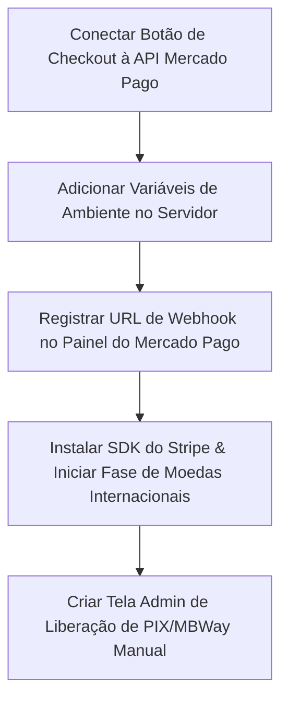

# 💰 Plano de Implementação: Checkout & Meios de Pagamento (PH LMS)

**Status Atual**: Fase de Integração Técnica e Conexão Frontend ➔ Backend
**Objetivo**: Automatizar a venda de cursos e ferramentas com liberação imediata de acesso via gateways (Mercado Pago e Stripe) e permitir notificação/aprovação de pagamentos manuais (PIX/MBWay).

---

## 1. Visão Geral dos Fluxos de Pagamento

A plataforma possui três vertentes de checkout estruturadas no sistema:
1. **Automático (Nacional - BRL)**: Processado via **Mercado Pago Checkout Pro** (PIX, Cartão de Crédito e Boleto).
2. **Automático (Internacional - USD/EUR)**: Planejado via **Stripe Hosted Checkout** (Multimoedas).
3. **Manual (Local/Regional)**: Transferência direta via **PIX (Brasil)** ou **MBWay/IBAN (Portugal/Europa)**, com aviso manual no checkout e liberação no painel administrativo.

---

## 2. Status Atual de Implementação

### 2.1. Arquitetura de Dados (Database)
* **[x] Schema Multimoedas**: Tabelas `planos`, `planos_cursos` e `cursos` já possuem suporte a precificação em Euro (`€`) e Dólar (`$`).
* **[x] Controle de Acesso**: Tabela `assinaturas` estruturada para receber vigência dinâmica baseada nos meses contratados do plano.
* **[x] Novo Aluno (Convites)**: Tabela `convites_matricula` pronta para guardar tokens de novos alunos que compraram sem possuir conta ativa no Supabase.
* **[x] Logs e Segurança**: Políticas de Row Level Security (RLS) refinadas e tabela `logs_matriculas` pronta para garantir a idempotência de transações.

### 2.2. Integração Mercado Pago (BRL)
* **[x] API de Preferências**: [`criar-preferencia/route.ts`](file:///c:/Projetos/phdonassolo-site/area-do-aluno/src/app/api/pagamentos/criar-preferencia/route.ts) implementada. Realiza a busca de preços, aplicação de cupons de desconto, geração de logs e cria a preferência no Mercado Pago.
* **[x] Webhook de Retorno**: [`webhooks/mercadopago/route.ts`](file:///c:/Projetos/phdonassolo-site/area-do-aluno/src/app/api/webhooks/mercadopago/route.ts) implementado. Recebe o status `approved`, valida idempotência, cria matrícula direta (se usuário já existe) ou gera token de convite com disparo de e-mail transacional (se for novo usuário).
* **[ ] Conexão UI ➔ API (GAP)**: A página de checkout no frontend (`checkout/[id]/page.tsx`) atualmente chama uma Server Action de simulação (`simularCompraMatricula`) que gera a matrícula de graça.
* **[ ] Variáveis de Ambiente**: Necessário configurar as chaves de produção (`MP_ACCESS_TOKEN`) e URL do site (`NEXT_PUBLIC_SITE_URL`).

### 2.3. Integração Stripe (USD/EUR)
* **[x] Banco & Painel Admin**: Campos para EUR e USD já criados nas tabelas e no painel admin de edição de planos.
* **[ ] Instalação de SDK (Pendente)**: Pacote `stripe` não está no `package.json`.
* **[ ] Rota de Session (Pendente)**: Criar `/api/pagamentos/stripe/criar-sessao` para gerar o checkout na moeda correta.
* **[ ] Rota de Webhook (Pendente)**: Criar `/api/webhooks/stripe` para escutar `checkout.session.completed` e liberar matrículas.

### 2.4. Fluxo de Pagamento Manual (PIX / MBWay)
* **[x] Interface do Usuário**: Card do checkout exibe chaves PIX (BR) ou MBWay/IBAN (PT) dinamicamente com base na seleção do usuário.
* **[x] Configuração no Admin**: Painel permite alterar chaves bancárias e definir e-mail de recebimento de notificações administrativas.
* **[x] Ação de Aviso**: Botão de aviso manual envia a intenção de pagamento à administração (`notificarPagamentoManual`).
* **[ ] Painel de Aprovação (GAP)**: Falta uma tela administrativa para listar notificações manuais e permitir a liberação com 1 clique.

---

## 3. Plano de Ação: Próximos Passos Imediatos



### Passo 1: Conectar a Interface de Checkout à API Real (Mercado Pago)
No arquivo [`src/app/(protected)/checkout/[id]/page.tsx`](file:///c:/Projetos/phdonassolo-site/area-do-aluno/src/app/%28protected%29/checkout/%5Bid%5D/page.tsx), alterar a função `handleCheckout` para que, ao selecionar o pagamento **Automático**, dispare uma requisição HTTP POST para `/api/pagamentos/criar-preferencia`:
```typescript
const handleCheckout = async () => {
  if (payMethod === 'manual') {
    return handleManualNotification();
  }

  setCheckingOut(true);
  try {
    const res = await fetch('/api/pagamentos/criar-preferencia', {
      method: 'POST',
      headers: { 'Content-Type': 'application/json' },
      body: JSON.stringify({
        cursoId: produto.id,
        cupomCodigo: couponStatus.valid ? couponCode : undefined
      })
    });
    
    const data = await res.json();
    if (res.ok && data.init_point) {
      // Redireciona o usuário para o Mercado Pago Checkout Pro
      window.location.href = data.init_point;
    } else {
      alert(data.error || 'Falha ao processar checkout automático.');
    }
  } catch (err) {
    alert('Erro ao se conectar ao servidor de pagamentos.');
  } finally {
    setCheckingOut(false);
  }
};
```

### Passo 2: Configuração de Produção e Homologação
1. Adicionar as seguintes variáveis ao `.env` de produção:
   ```env
   # Mercado Pago
   MP_ACCESS_TOKEN=APP_USR-xxxxxxxxx-xxxxxxxx-xxxxxx
   
   # Site URL (utilizado nas Back URLs e Webhooks)
   NEXT_PUBLIC_SITE_URL=https://area.phdonassolo.com
   ```
2. Configurar o endpoint de webhook no painel de desenvolvedores do Mercado Pago apontando para:
   `https://area.phdonassolo.com/api/webhooks/mercadopago`
   *(Assinar os eventos de "Pagamentos" / `payment`)*

### Passo 3: Implementação da Fase Stripe (Multimoedas)
1. Instalar a biblioteca:
   `npm install stripe`
2. Criar a API Route `/api/pagamentos/stripe/criar-sessao` para ler a moeda selecionada (`BRL`, `EUR`, `USD`) e iniciar a sessão no gateway.
3. Desenvolver o webhook `/api/webhooks/stripe` com validação de assinatura `stripe-signature` para ativação automática das matrículas no banco de dados.

### Passo 4: Painel Administrativo de Pagamentos Manuais
Criar uma aba ou página no Backoffice (`/admin/pagamentos-manuais`) que permita:
1. Listar os logs de notificações feitas pelos alunos.
2. Botão **"Aprovar Matrícula"**: Dispara uma Server Action que cria o registro em `assinaturas` e envia o e-mail de confirmação.

---
*Documento atualizado em 30/05/2026 para refletir o real progresso da arquitetura e as ações pendentes.*
